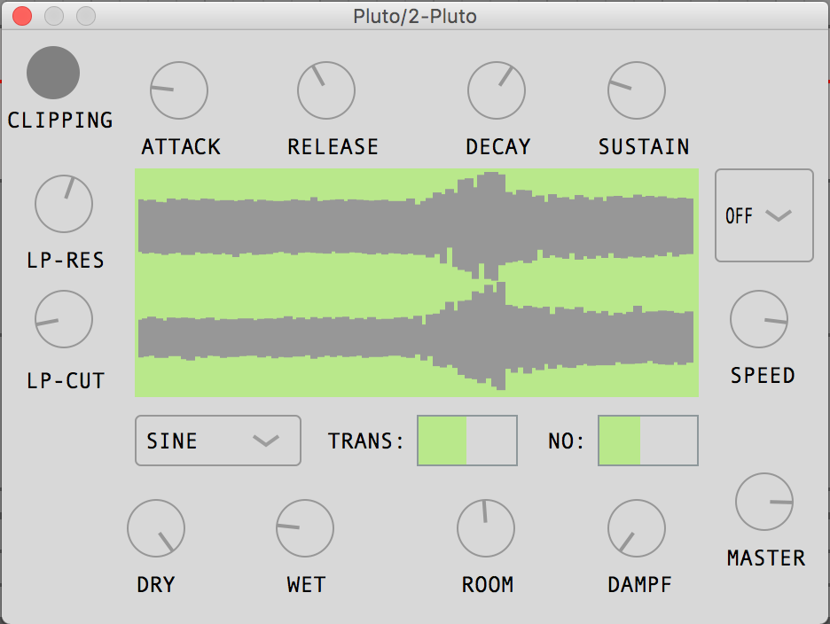

# Pluto

A subtractive synthesizer plugin based on Juce.

## Features

- 9 different wave types
- Low-Pass filter
- ARP midi effect
- Envelope controll
- Transpose in quater notes
- Noise generator
- Clipping detection
- Reverb effect
- Master volume controll
- Wave monitor
